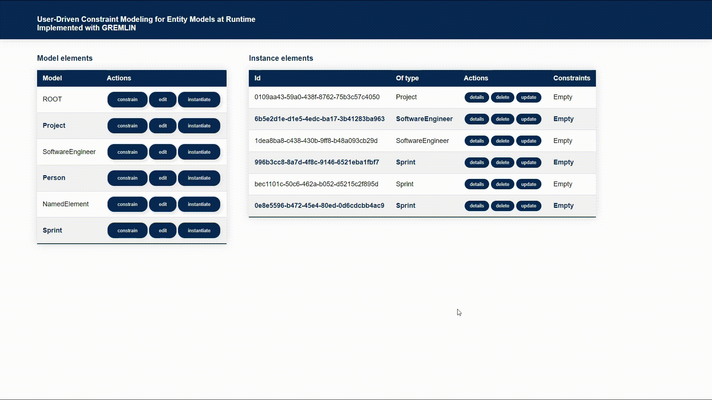

# User-driven constraint modeling for entity models at runtime (EUMCF)

A framework to apply and validate constraints on variant-aware entity models at runtime.

This repository contains the theoretical as well as practical parts of the master's thesis **User-Driven Constraint Modeling for Entity Models at Runtime**

## Overview
In today’s fast-paced technological landscape, businesses and organizations require flexible and adaptable software systems that are able to respond dynamically to evolving demands of business and its customers. The crucial part of any modern software is a domain layer that encapsulates the business rules and data of a target system into a set of entities and interrelations among them. However, only models are often insufficient to express all types of enterprise requirements, especially if they emerge in real-time and systems must adjust dynamically while still remaining available.

The highlight of this work is a framework that permits the intuitive and effective formulation of constraints on a domain layer and their validation at runtime. In addition, the dynamic nature of adaptive models is also taken into account. Therefore, the constraint space is kept up-todate by employing the mechanisms like constraint synchronization and backward links. The framework’s design is modular and extensible, allowing easy integration within existing software systems.

## Demonstration
A demo video can be found here --> [click me](https://cloudstore.zih.tu-dresden.de/index.php/s/b6WqqQoH4NYrc54)

### Constraint definition example

### Constraint validation example

### Complex constraint definition

### All in one

## Modules description

The architecture of the framework consists of several modules. Below is a short description for each of them.

* **end-user-modeling-constraint-framework-spec** - contains the common domain classes, services, and interfaces that can be used by a platform-specific implemenentation of the framework as well by cleint software.
* **end-user-modeling-constraint-framework-gremlin** -  platform-specific implemenentation of the specification module using the *Gremlin* Query Language. More information about Gremlin can be found here -> [click me](https://tinkerpop.apache.org/gremlin.html).
* **end-user-modeling-constraint-framework-shacl** - platform-specific implemenentation of the specification module using the *Shapes Constraint Language (SHACL)*. More information about SHACL can be found here -> [click me](https://www.w3.org/TR/shacl/).
* **end-user-modeling-constraint-framework** - Server-side rendering Spring Web Application plays the role of a client software and uses the constraint modeling framework to define constraints on the domain layer at runtime. This module is bound to [Modicio](https://github.com/modicio) to manage and manipulate the domain layer dynamically at runtime.
* **end-user-modeling-constraint-framework-case-study** - a case-study application that compares the Gremlin and SHACL platform-specific implemenentations in terms of performance.

## Quick start
### Prerequisites
1. Installed Java SDK 11+
2. Installed Maven
3. Installed Git

### Setting up the environment
1. **Clone repo:** `git clone https://github.com/AntonSk98/master-thesis-user-driven-constraint-modelling-for-entity-models-at-runtime.git`
2. **Set envronment variable *MODICIO_JAR_PATH*** which is an abosolute path to modicio jar that is located in the cloned repository. Please note, that modicio is an ongoing project that is currently under an active development. Therefore, there is no guarantee that the showcase framework will be running with other versions of modicio. **Therefore, do one of the following:**
    * **for windows** -> `set MODICIO_JAR_PATH=$PATH_TO_REPO/master-thesis-user-driven-constraint-modelling-for-entity-models-at-runtime/modicio_2.13.jar`;
    * **for linux** -> `export MODICIO_JAR_PATH=$PATH_TO_REPO/master-thesis-user-driven-constraint-modelling-for-entity-models-at-runtime/modicio_2.13.jar`
3. **Go into the cloned repository:** `cd $PATH_TO_REPO/master-thesis-user-driven-constraint-modelling-for-entity-models-at-runtime`
4. **Compile the specification module:** `mvn -f end-user-modeling-constraint-framework-spec/pom.xml clean install`
5. **Compile the platform-specific implemenentation with Gremlin:** `mvn -f end-user-modeling-constraint-framework-gremlin/pom.xml clean install`
6. **Compile the platform-specific implementation with SHACL:** `mvn -f end-user-modeling-constraint-framework-shacl/pom.xml clean install`
7. Finally, **compile the showcase Spring boot application:** `mvn -f end-user-modeling-constraint-framework/pom.xml clean install`

**As a result**, an executable jar will be generated in the *end-user-modeling-constraint-framework/target* directory

### Start the platform-specific implementation with Gremlin
1. **Navigate to:** `cd end-user-modeling-constraint-framework/target`
2. **Invoke:** `java -jar -Dspring.profiles.active=testdata,gremlin -Dserver.port=8080 end-user-modeling-constraint-framework-1.0.0.jar`, where

* testdata -> profile to generate a sample domain using Modicio
* gremlin -> profile that injects gremlin-related services in the configuration
* server.port=8080 -> the port number on which the embedded web server will listen for incoming requests

The application can be accessed under the following URI: localhost:8080

### Start the platform-specific implementation with Shacl
1. **Navigate to:** `cd end-user-modeling-constraint-framework/target`
2. **Invoke:** `java -jar -Dspring.profiles.active=testdata,shacl -Dserver.port=8081 end-user-modeling-constraint-framework-1.0.0.jar`, where

* testdata -> profile to generate a sample domain using Modicio
* shacl -> profile that injects gremlin-related services in the configuration
* server.port=8081 -> the port number on which the embedded web server will listen for incoming requests

The showcase application can be accessed under the following URI: *localhost:<server.port>*

